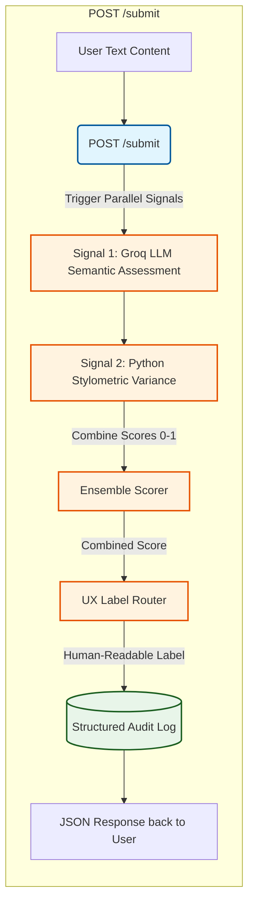
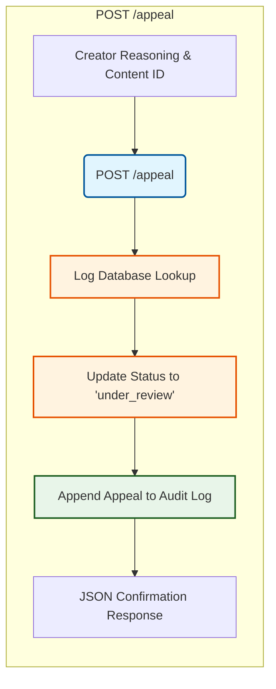

# Planning Specification: Provenance Guard

## Architecture Narrative

### 1. The Submission Flow (POST /submit)
    The creator sends text to /submit endpoint
    The endpoint passes this raw text simultaneously to Signal 1 (Groq LLM) and Signal 2 (Stylometric Heuristics).
    The engine takes both individual numbers, calculates a weighted average, and produces a final `confidence` score between 0.0 and 1.0.
    The score passes through a threshold rules to generate a `transparency label`.
    The system generates a unique content_id, bundles all scores, labels, and timestamps together, and appends them as a new row in a local Audit Log.
    The user receives a clean JSON response.
### 2. The Appeal Flow (POST /appeal)
    A creator provides a content_id and their explanation text (creator_reasoning) to the /appeal endpoint.
    The system searches the Audit Log for that specific ID, changes its status field from "classified" to "under_review", and attaches the explanation text.
    The user receives a confirmation message.

## Two Signals & Blind Spots
    
### Groq LLM Semantic Assessment
    It measures sentence flow, word transitions, semantic structure, and repetitive phrases commonly favored by LLMs (like "Furthermore," "It is important to note," or "In conclusion").
    It works because AI text defaults to predictable, highly generic patterns.
    Its Blind Spot: It fails to detect heavily edited AI text, or human writers who naturally write in a formal, dry, corporate style.
### Stylometric Sentence Length Variance (Pure Python)
    It measures the mathematical standard deviation of a sentence lengths across the text.
    It works because AI models prioritize uniform sentence lengths. Humans naturally vary their pace, writing short, punchy fragments alongside lengthy, descriptive sentences.
    Its Blind Spot: Short text blocks (like a short poem or a tweet) do not provide enough sentences to generate a statistically meaningful mathematical variance.

## Architecture Flow

### Submission Flow

### Appeal Flow

## Uncertainty Representation & Thresholds

Our final confidence score is mapped from `0.0` (Definitely Human) to `1.0` (Definitely AI). Because falsely accusing a human creator of using AI is highly damaging on a creative writing platform, our thresholds are deliberately weighted to give the creator the benefit of the doubt.

* **Score < 0.40:** High-Confidence Human
* **0.40 <= Score <= 0.75:** Uncertain / Inconclusive
* **Score > 0.75:** High-Confidence AI

### Scoring Calculation Strategy
The final confidence score is derived through a weighted ensemble calculation:
$$\text{Final Score} = (0.65 \times \text{Groq LLM Score}) + (0.35 \times \text{Stylometric Variance Score})$$

---

## Transparency Label Variants

Below are the exact verbatim plain-language text strings shown to our users based on the calibrated thresholds:

| Result Classification | Score Range | Verbatim Transparency Label Text |
| :--- | :--- | :--- |
| **High-Confidence Human** | `0.00 - 0.39` | "Verified Original: Our system recognizes this text as original, human-crafted creative work." |
| **Uncertain** | `0.40 - 0.75` | "Attribution Unclear: This text contains a blend of structural patterns. We are unable to confidently verify its origin." |
| **High-Confidence AI** | `0.76 - 1.00` | "Generated Content: Our system has detected a high probability of automated or AI-assisted writing patterns within this text." |

---

## Appeals Workflow & System Operations

### 1. Operation Mechanics
* **Who can appeal:** Any logged-in creator whose submitted text returns a score higher than `0.39`.
* **Required Data:** The system captures the target text's `content_id` and an explicit `creator_reasoning` text field explaining why the text was flagged unfairly.
* **System Action:** The system immediately transitions the document's tracking status from `"classified"` to `"under_review"`. This status change along with the reasoning is appended directly into the audit log history.

### 2. Anticipated Edge Cases (System Vulnerabilities)
* **The Academic/Non-Native Writer:** Non-native English speakers or technical academics naturally write with highly formalized, structured language and uniform sentence lengths. Our stylometric heuristics might mistake this lack of structural variance for AI text generation.
* **Experimental/Repetitive Poetry:** Creative human poetry that heavily leverages intentional repetition, identical line counts, or rhythmic prose structures will score artificially high on uniformity checks, resulting in an incorrect AI flag.

---

## AI Tool Plan

We will utilize AI code generation models sequentially across the following implementation milestones:

### Milestone 3: Submission Infrastructure & Signal 1
* **Input Provided:** The `## Architecture Narrative` text, the `Submission Flow` Mermaid diagram, and the `Groq LLM Semantic Assessment` definitions.
* **Prompt Request:** "Generate a minimal Flask API skeleton with a POST /submit endpoint, a GET /log endpoint, and a working standalone function using the Groq python SDK to score text complexity."
* **Verification Strategy:** Manually run cURL requests against the server to check that the `/submit` payload accurately returns a valid unique ID string variable and baseline response.

### Milestone 4: Signal Ensemble Integration
* **Input Provided:** The `Two Signals & Blind Spots` section and the `Scoring Calculation Strategy` formulas and thresholds.
* **Prompt Request:** "Write a pure Python helper function calculating text sentence length standard deviation and an ensemble function combining it with our Groq metric."
* **Verification Strategy:** Pass the four required assignment benchmark text paragraphs to ensure the scoring outputs correctly register inside different threshold brackets.

### Milestone 5: Production Safety & Appeals
* **Input Provided:** The `Transparency Label Variants` table and `POST /appeal` specifications.
* **Prompt Request:** "Implement the POST /appeal route updating our local dictionary state to 'under_review' and wire up Flask-Limiter to drop requests over 10 per minute."
* **Verification Strategy:** Execute a rapid loop shell script to purposefully trigger a `429 Too Many Requests` error state.